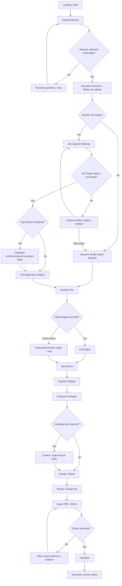

# Candidate Journey

**Product:** Resume Analyze Tool  
**Market:** New Zealand  
**Status:** Working end-to-end candidate journey  
**Date:** 2026-09-28

## Journey goal

Help a job seeker move from **"I have a Resume and I want to improve my chances"** to **"I have a clearer, more machine-readable, role-aligned Resume that I understand and control"** with as little unnecessary friction as possible.

The experience supports two outcomes:

- **Resume Health Check** when the candidate has no specific Job Target.
- **Full Application Analysis** when the candidate wants to optimize against a specific role.

These are not separate products. They share the same entry, Resume ingestion, report model, optimization model, and export flow.

---

# Entry conditions

A candidate may arrive in several states:

1. They already have a Resume and a specific job they want.
2. They have a Resume but no specific job yet.
3. They have a job ad but their Resume is weak or outdated.
4. They are returning to a still-active anonymous session.
5. They are returning after the session expired.
6. They are on mobile with only screenshots or downloaded files available.
7. They have low confidence in what ATS advice is trustworthy and want factual guidance rather than generic scoring.

The default journey must work without authentication.

---

# Primary journey

## Stage 1: Entry

### Candidate goal

Understand what the tool does and start quickly.

### Candidate action

The candidate lands on the product and chooses to begin.

### System response

Show a concise promise:

- upload your Resume;
- optionally add a Job Target;
- get evidence-backed feedback;
- accept or reject proposed changes;
- export an improved Resume.

The interface should make clear that:
- no account is required for the MVP;
- the tool does not guarantee interviews;
- candidate facts will not be invented;
- raw uploads are temporary.

### State transition

`created`

### Cognitive load

Low.

### UX requirement

Do not force the candidate to choose between technical modes such as "ATS scan", "AI scan", "semantic scan", or "platform scan" before they have supplied any material.

---

## Stage 2: Resume upload

### Candidate goal

Provide the Resume they actually use.

### Candidate action

Upload or drop a PDF or DOCX.

### System response

Immediately validate:
- format;
- basic file integrity;
- encryption/protection;
- size;
- extractability/security conditions.

Show the filename and a clear processing state.

### State transition

`created → resume_received`

### Success branch

Continue automatically to extraction.

### Failure branches

#### Unsupported format

Explain:
- what was provided;
- what is fully supported now;
- whether the format is known to be accepted by LinkedIn/SEEK even if our parser cannot fully analyze it;
- how to convert or retry.

#### Corrupt/encrypted file

Explain why the file cannot be analyzed and what the candidate can do.

#### Scanned/image-only file

Attempt supported OCR/vision fallback.

If confidence remains too low, ask for another version rather than pretending parsing succeeded.

### Cognitive load

Low to moderate only on failure.

---

## Stage 3: Resume normalization

### Candidate goal

Have the system understand their Resume correctly.

### Candidate action

Usually none.

### System response

Extract and normalize:
- contact information;
- work history;
- education;
- skills;
- qualifications;
- dates;
- sections;
- relevant evidence.

Delete the raw Resume after successful normalization.

### State transition

`resume_received → resume_normalized`

### Important UX behavior

Do not show an unnecessary "review every extracted field" screen by default.

Only interrupt the user if:
- extraction confidence is materially low;
- a high-impact field is ambiguous;
- continuing would make the analysis unreliable.

### Cognitive load

Low.

---

## Stage 4: Choose analysis depth

### Candidate goal

Get the best analysis available for their current situation.

### Candidate action

The interface asks a simple question:

**Are you applying for a specific job?**

Options:
- **Yes, analyze against a job**
- **No, check my Resume first**

### Why this decision exists

A Job Target materially improves qualification and screening analysis. It should not be mandatory for a Resume Health Check.

### Branch A: Resume Health Check

Continue directly to analysis.

### Branch B: Full Application Analysis

Continue to Job Capture.

### State transition

`resume_normalized → target_optional`

### Cognitive load

Low.

---

# Full Application Analysis branch

## Stage 5: Capture Job Target

### Candidate goal

Provide the target role without manually retyping the entire listing.

### Candidate action

Choose the easiest available capture method.

Preferred order:

1. upload screenshot(s)/image of the job listing;
2. upload saved job-ad PDF/document;
3. provide a URL when the source supports permitted retrieval;
4. paste text as fallback.

### System response

Normalize the input into a Job Target.

Extract:
- title;
- employer;
- source/platform;
- job description;
- required qualifications;
- preferred qualifications;
- skills;
- experience requirements;
- certifications/licences;
- screening/application questions when present.

### State transition

`target_optional → target_captured`

### Policy behavior

If a supplied URL cannot be retrieved compliantly:
- say that automatic import is not available for that source;
- offer screenshot/document upload;
- offer text paste as fallback;
- do not silently scrape.

### Cognitive load

Low if capture succeeds, moderate on fallback.

---

## Stage 6: Job Target confidence checkpoint

### Candidate goal

Ensure the system understood the job correctly without manually reviewing everything.

### System behavior

If confidence is high:
- proceed automatically.

If confidence is low on a high-impact field:
- show only the uncertain fields;
- show the extracted value and source context;
- ask the candidate to confirm or correct.

Examples:
- "Is 5 years of experience required, or preferred?"
- "Is a New Zealand driver's licence mandatory?"
- "We could not tell whether this certification is required."

### State transition

High confidence:
`target_captured → target_confirmed`

Low confidence:
`target_captured → target_review_required → target_confirmed`

### Cognitive load

Low to moderate.

### Design rule

Never turn this checkpoint into a giant form containing the entire job ad.

---

# Shared analysis journey

## Stage 7: Start Analysis Run

### Candidate goal

Receive a useful answer without wondering whether the system froze.

### Candidate action

Usually none beyond confirming the inputs.

### System response

Begin the Analysis Run.

Progress should reflect real system stages such as:
- reading Resume;
- checking document compatibility;
- checking structure and parseability;
- comparing to Job Target if present;
- validating recommendations;
- preparing report.

### State transition

`analysis_queued → analyzing`

### Latency behavior

Do not show fake percentages.

Use stage-based progress and plain language.

If analysis takes longer than expected:
- maintain visible progress state;
- preserve the session;
- avoid restarting completed stages.

### Cognitive load

Low if status is clear.

---

## Stage 8: Partial-failure branch

### Trigger

A model-assisted stage fails after deterministic analysis completed.

### Candidate goal

Still get value from work already completed.

### System response

Show a partial report containing safe completed results such as:
- Document Compatibility;
- Parseability;
- verified platform findings.

Explain that semantic matching or rewrite suggestions are temporarily unavailable.

Offer retry for the missing stage without requiring a new Resume upload while the session is still valid.

### State transition

`analyzing → model_partial_failure → report_ready`

### Design rule

Do not convert one provider outage into total product failure.

---

## Stage 9: Report overview

### Candidate goal

Understand what matters first.

### System response

The first report view should prioritize action, not diagnosis volume.

Show:

1. **Top Actions**
2. Analysis dimensions:
   - Document Compatibility
   - Parseability
   - Qualification Coverage, when a Job Target exists
   - Screening Alignment, when relevant
3. High-level status and confidence
4. Prioritized finding counts:
   - Critical
   - High Impact
   - Improvement
   - Optional Polish

### State transition

`analyzing → report_ready`

### Cognitive load

Moderate.

### Design rule

Do not lead with an opaque overall score.

If Application Readiness is later introduced, it must be secondary to explainable dimensions.

---

## Stage 10: Explore findings

### Candidate goal

Understand why a change is recommended.

### Candidate action

Open a finding.

### System response

Each finding should show:

- what the issue is;
- why it matters;
- severity;
- confidence;
- the Resume evidence involved;
- Job Target evidence if applicable;
- Evidence Class;
- official source when platform-specific;
- what action is recommended.

### Candidate understanding

The candidate should be able to distinguish:

- verified platform rule;
- platform behavior;
- general ATS heuristic;
- writing guidance;
- model inference.

### Cognitive load

Moderate to high.

### Design response

Progressive disclosure is required. The candidate should not need to read every citation before understanding the recommendation.

---

# Optimization journey

## Stage 11: Proposed Change

### Candidate goal

Improve the Resume without manually translating every finding into new wording.

### System response

Where safe, present a Proposed Change.

Every proposal has one of six classes:

- Rewrite supported evidence
- Clarify existing evidence
- Reposition existing evidence
- Candidate confirmation required
- Missing qualification
- Cannot recommend truthfully

### State transition

`report_ready → optimizing`

### Design rule

A finding may exist without a Proposed Change.

The product should prefer "I cannot safely rewrite this" over invented polish.

---

## Stage 12: Candidate truth confirmation

### Trigger

A potentially useful change depends on a fact that is not established by the Resume.

### Candidate goal

Tell the system whether the fact is actually true.

### Candidate action

Confirm, reject, or provide the missing factual detail.

### Example

The Job Target requests Kubernetes.

The Resume does not establish Kubernetes experience.

The tool may ask:
- "Do you have professional or project experience with Kubernetes?"

It must not insert Kubernetes automatically.

### State behavior

If confirmed:
- candidate-confirmed evidence becomes available to the change flow.

If rejected:
- the system preserves the gap as Missing qualification or Cannot recommend truthfully.

### Cognitive load

Moderate.

### Design rule

Ask one focused truth question at the point where it unlocks a meaningful improvement. Do not interrogate the candidate about every imaginable missing keyword.

---

## Stage 13: Accept / Reject

### Candidate goal

Retain control over the Resume.

### Candidate action

For each Proposed Change:
- Accept
- Reject
- Edit, if editable proposal support is included
- Skip for now

### System response

Maintain a visible Change Set.

Show:
- accepted;
- rejected;
- unresolved confirmations.

### Design rule

No "accept all" control should silently accept candidate-confirmation items or unsupported claims.

An eventual bulk accept may be allowed only for safe proposal classes and must remain reversible within the active session.

---

## Stage 14: Before / after review

### Candidate goal

Understand what will actually change before export.

### System response

Offer a concise review of accepted changes.

Prefer:
- section-level before/after;
- changed passages;
- change rationale.

Avoid forcing the candidate to reread the entire Resume line by line.

### Cognitive load

Moderate.

---

## Stage 15: Export

### Candidate goal

Leave with a usable optimized Resume.

### Candidate action

Choose an available format.

Target formats:
- PDF
- DOCX

### System response

Generate from:
- normalized Resume;
- candidate-confirmed facts;
- accepted Change Set.

No fresh generative rewriting is allowed during export.

### State transition

`optimizing → export_ready`

### Failure branch

If export fails:
- keep the report and accepted Change Set;
- allow retry;
- do not rerun analysis.

---

## Stage 16: Completion

### Candidate goal

Know what happened and what remains.

### System response

Confirm:
- export is ready/downloaded;
- raw upload was already deleted after extraction;
- anonymous session will expire automatically;
- unsaved report/change data will disappear after expiry.

Optional next action:
- analyze another Job Target using the active normalized Resume, if privacy/session policy allows;
- start a new Resume analysis.

### Design rule

Do not force signup at completion.

If candidate accounts are added later, "save this analysis" can be an optional value exchange rather than a gate.

---

# Alternate journeys

## A. Resume Health Check only

Path:

`Entry → Resume Upload → Normalize Resume → No specific job → Analyze → Report → Optimize → Export`

Differences:
- no Qualification Coverage against a specific role;
- no Job Target capture;
- no job-specific screening alignment unless candidate supplied relevant questions separately.

The report should clearly explain which insights require a Job Target to become available.

---

## B. Full Application Analysis

Path:

`Entry → Resume Upload → Normalize Resume → Specific job → Job Capture → Confidence Review if needed → Analyze → Report → Optimize → Export`

This is the flagship journey.

---

## C. Resume extraction failure

Path:

`Upload → Validation/Extraction failure → Recovery`

Recovery options may include:
- retry upload;
- use another file version;
- convert file;
- OCR/vision fallback;
- return later.

Never continue into semantic analysis from unreliable extraction.

---

## D. Job Capture failure

Path:

`Job Capture → Cannot normalize → Alternative capture`

Offer:
- screenshot/image;
- saved file;
- permitted URL;
- paste fallback.

The candidate can also choose:
- "Continue with Resume Health Check instead."

This avoids a dead end.

---

## E. Interrupted session

### Same device, session still alive

Restore the latest safe state:
- normalized Resume;
- Job Target;
- completed Analysis Result;
- Change Set.

Do not force re-upload if the raw file has already been deleted but normalized state remains valid.

### Session expired

Explain:
- the anonymous session expired;
- candidate content was not permanently stored;
- a new Resume upload is required.

Do not imply the system can recover deleted personal data.

---

## F. Slow connection

Requirements:
- upload progress;
- resumable or clearly retryable upload where technically practical;
- no duplicate Analysis Run from repeated button taps;
- lightweight report UI before optional heavy previews;
- status text understandable without animation.

---

## G. AI provider unavailable

Show:
- deterministic findings;
- clear partial-report state;
- retry semantic analysis.

Do not present missing AI stages as a zero score.

---

## H. Candidate cancels

Before analysis:
- stop processing where practical;
- clean temporary raw artifacts.

During analysis:
- allow leaving/canceling;
- ensure cleanup still occurs.

After report:
- candidate may leave without exporting;
- session expiry handles cleanup.

---

## I. Returning anonymous candidate

The MVP has no durable account.

If the browser retains a valid session token and the session has not expired:
- resume the active journey.

If expired:
- start a new session.

Cross-device continuation is out of scope without candidate accounts or an explicit transfer mechanism.

---

# Journey map

---

# Screen / interaction purpose

Every candidate-facing step must either:
- provide required input;
- prevent an unsafe or misleading result;
- explain a meaningful result;
- capture candidate control;
- recover from failure;
- produce the usable output.

If a proposed screen does none of these, remove it.

This specifically argues against:
- mandatory signup screens;
- a separate "choose ATS engine" screen;
- a giant extracted-data review form;
- a standalone loading page with fake progress;
- a separate page for every scoring dimension;
- forced tutorial carousels before upload.

---

# Friction hotspots

## 1. Job Capture without direct LinkedIn/SEEK retrieval

Risk:
Candidates expect "paste URL and go".

Design response:
Lead with screenshot/file capture as a first-class automated path, not as an error fallback.

The UI should communicate:
"Add the job ad" rather than "Paste job description".

---

## 2. Candidate confirmation can feel like extra work

Risk:
Truth verification may feel like the AI is giving work back to the user.

Design response:
Ask only questions that unlock a meaningful change or resolve a high-impact ambiguity.

---

## 3. Long analysis latency

Risk:
The combination of extraction, OCR, rules, semantic matching, validation, and optimization may feel slow.

Design response:
Use real stage progress, preserve completed work, and allow partial deterministic results.

---

## 4. Too many findings

Risk:
A thorough report can become exhausting.

Design response:
Top Actions first, then severity groups, then progressive detail.

---

## 5. Evidence provenance can overwhelm normal users

Risk:
Source classes and citations are useful but technical.

Design response:
Use plain-language labels by default and expose detailed provenance progressively.

Example:
- "Verified LinkedIn rule"
- "General ATS guidance"
- "AI interpretation"

The canonical Evidence Class remains in the data model.

---

## 6. Anonymous sessions can expire before a candidate finishes

Risk:
A candidate may spend time reviewing changes and lose the session.

Design response:
Warn meaningfully before expiry if technically feasible, extend activity-based TTL where policy allows, and make the retention rule clear.

Exact TTL remains unresolved.

---

# Emotional / cognitive journey

## Entry

Likely state:
uncertain, skeptical, hopeful.

Design goal:
reduce ambiguity and establish credibility without hype.

## Upload

Likely state:
small privacy concern.

Design goal:
make temporary handling explicit and concise.

## Job Capture

Likely state:
impatience if manual work appears.

Design goal:
make multimodal capture feel faster than copy/paste.

## Analysis

Likely state:
anticipation.

Design goal:
show real progress and avoid fake precision.

## Results

Likely state:
potential overwhelm or defensiveness.

Design goal:
prioritize, explain, and distinguish missing evidence from personal inadequacy.

## Optimization

Likely state:
high engagement but risk of blindly accepting AI suggestions.

Design goal:
keep candidate agency visible.

## Export

Likely state:
relief and readiness to act.

Design goal:
deliver a trustworthy document without sneaking in additional changes.

---

# Evidence and assumptions

## Established

- Anonymous candidate use is the MVP default.
- Resume Health Check and Full Application Analysis are both supported.
- Full Application Analysis is the flagship experience.
- PDF and DOCX are first-class Resume inputs.
- Job Capture must not depend on unauthorized LinkedIn/SEEK scraping.
- Multimodal capture is the preferred automated alternative.
- Candidate truth must be preserved.
- Deterministic evidence outranks model inference.
- Proposed Changes require candidate control.
- Raw Resume uploads are deleted after successful normalization.
- The backend owns orchestration and analysis.

## Assumptions still needing validation

- Candidates will accept screenshot/file-based Job Capture when direct URL import is unavailable.
- A small Top Actions set will be more useful than displaying all findings equally.
- Candidates will understand the distinction between Resume Health Check and Full Application Analysis from one simple job-target question.
- Candidates will accept anonymous-session expiry in exchange for stronger privacy.
- Candidate fact-confirmation prompts will feel trustworthy rather than burdensome when they are sparse and contextual.

These are design hypotheses, not user-research findings.

---

# Journey decisions

1. Resume Health Check and Full Application Analysis share one entry and one report/optimization framework.
2. The candidate chooses analysis depth only after the Resume is normalized.
3. Job Capture uses the language of **adding a job**, not technical ingestion terminology.
4. High-confidence Job Target extraction continues automatically.
5. Only low-confidence, high-impact fields interrupt the candidate.
6. Analysis progress is stage-based, never fake percentage-based.
7. Partial deterministic results are candidate-visible when model stages fail.
8. Top Actions precede detailed findings.
9. Finding provenance is progressively disclosed in plain language.
10. Truth confirmation occurs contextually, only when it can unlock a meaningful recommendation.
11. Accept/Reject is the primary optimization control.
12. Export introduces no new generative changes.
13. Anonymous session restoration is allowed only while the session is valid.
14. Cross-device continuation is out of scope for the no-account MVP.
15. Job Capture failure always provides an alternate capture path or a downgrade to Resume Health Check.

---

# Pending questions / assumptions

The journey is stable enough for screen design, but the following should be resolved during wireframing/fortification:

- exact landing-page information density;
- whether Resume upload precedes the Health Check / Full Analysis choice visually, as recommended here;
- how many Top Actions should appear by default;
- whether Proposed Changes support inline candidate editing in MVP or only accept/reject;
- exact session-expiry warning behavior;
- whether mobile screenshot capture should support direct camera/photo selection;
- whether PDF and DOCX export both ship in the first client release;
- how much official-source detail appears directly in the report versus a details drawer;
- whether a candidate can reuse the same normalized Resume for a second Job Target within the same active session;
- exact accessibility behavior for progress/status announcements and before/after change review.
