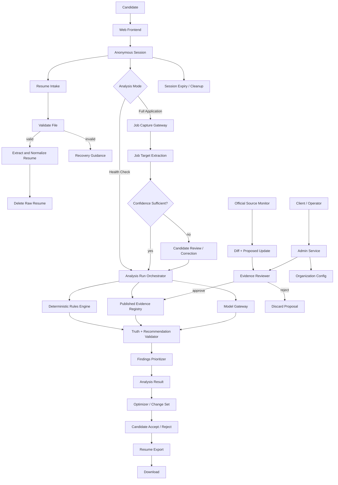

# Service Blueprint

**Product:** Resume Analyze Tool  
**Market:** New Zealand  
**Status:** Working service/system blueprint  
**Date:** 2026-09-28

## Purpose

This blueprint maps the Resume Analyze Tool as a service system, not only as a web interface.

The product must let a candidate submit a Resume, optionally capture a Job Target with minimal manual work, receive an explainable analysis, accept or reject truthful improvements, and export an optimized Resume.

The system must preserve candidate truth, distinguish verified platform evidence from model inference, avoid unauthorized LinkedIn/SEEK scraping, minimize retention of personal data, and remain operable when external AI or source-monitoring services fail.

---

# Actors

## Candidate

The job seeker using Resume Health Check or Full Application Analysis.

The Candidate:
- owns the truth of their work history, qualifications, achievements, skills, and other personal claims;
- decides which Proposed Changes are accepted;
- may use the product anonymously in the MVP;
- may supply a Resume, a Job Target source, and confirmations when evidence is ambiguous.

## Client / Operator

The organization purchasing or operating the deployment.

The Client / Operator:
- owns Organization-level configuration and branding;
- controls operational settings such as usage limits;
- can observe aggregate product health without reading candidate Resume content by default;
- does not silently alter candidate facts.

## Evidence Reviewer

An authorized operator role responsible for publishing Evidence Registry changes.

The Evidence Reviewer:
- reviews proposed changes derived from official source updates;
- can approve or reject a proposed Evidence Registry version;
- cannot make an unpublished draft affect production analysis.

## Product Services

The backend services that validate, extract, normalize, analyze, optimize, export, and clean up candidate data.

## External Dependencies

Potential dependencies include:
- document parsing libraries/services,
- OCR or vision processing,
- malware/file validation,
- an AI/model provider,
- temporary object storage,
- database/session storage,
- official source retrieval for Evidence Registry maintenance,
- future approved LinkedIn or SEEK partner APIs.

No external dependency is allowed to become an implicit source of truth above the published Evidence Registry.

---

# Experience Layers

## Candidate frontstage

The candidate should experience the system as a short sequence:

1. Start analysis.
2. Upload Resume.
3. Choose Resume Health Check or Full Application Analysis.
4. For Full Application Analysis, provide a Job Target through the Job Capture Gateway.
5. Review the captured Job Target if extraction confidence is insufficient or important fields are ambiguous.
6. Run analysis.
7. See Top Actions and detailed findings.
8. Review Proposed Changes.
9. Confirm candidate facts when required.
10. Accept or reject changes.
11. Export the optimized Resume.
12. Session expires automatically.

The frontstage should not expose internal provider names, queues, evidence-diff jobs, source-monitoring mechanics, or implementation details unless they materially affect the user's decision.

## Operator frontstage

The client/operator experience is separate from the candidate journey.

An authorized operator should be able to:
- sign in;
- manage Organization branding and configuration;
- review aggregate usage and operational health;
- inspect Evidence Registry update proposals;
- approve or reject Evidence Registry publication;
- configure limits and operational policy where permitted;
- see audit metadata without default access to raw candidate Resume content.

---

# Core Service Architecture

## 1. Web Frontend

Responsibilities:
- candidate upload and capture UI;
- anonymous session continuity;
- progress display;
- report presentation;
- Proposed Change accept/reject controls;
- candidate confirmation prompts;
- export initiation;
- client/operator admin UI.

The frontend is deliberately thin. It does not contain platform secrets, core scoring logic, Evidence Registry authority rules, or model credentials.

## 2. Anonymous Session Service

Creates a short-lived Candidate Session.

Responsibilities:
- issue a non-guessable session identifier;
- associate the session with in-progress Resume, Job Target, Analysis Run, and export artifacts;
- enforce expiry;
- avoid requiring candidate identity for the MVP.

The session identifier is not an account and must not become a durable cross-device identity accidentally.

## 3. Resume Intake Service

Receives the candidate Resume.

Responsibilities:
- enforce allowed upload sizes and types;
- perform security/file validation;
- reject corrupt, unsupported, encrypted, or unsafe input with a recovery path;
- place the raw upload in temporary storage only long enough for extraction.

## 4. Resume Extraction and Normalization

Converts PDF or DOCX into the normalized Resume model.

Responsibilities:
- extract text and structural information;
- identify candidate sections and evidence;
- calculate extraction confidence;
- detect scanned/image-only documents and trigger an OCR/vision fallback when supported;
- preserve the relationship between normalized facts and their source locations where practical;
- delete the raw Resume after successful extraction.

Downstream analysis operates on the normalized Resume, not directly on PDF/DOCX structures.

## 5. Job Capture Gateway

Accepts permitted Job Target inputs and normalizes them through adapters.

MVP candidate-provided adapters:
- image/screenshot upload;
- saved job-ad PDF/document;
- text paste fallback;
- URL retrieval only when the source permits automated retrieval.

Future adapters:
- approved LinkedIn integration;
- approved SEEK integration;
- other permitted job-board or employer-career-site integrations.

The Gateway must fail closed for unsupported or prohibited retrieval. It must never silently fall back to scraping.

## 6. Job Target Extraction and Normalization

Converts a capture input into a normalized Job Target.

Responsibilities:
- identify job title, employer, platform/source, job description;
- extract required and preferred qualifications;
- extract skills, licences, certifications, experience requirements, and screening questions where present;
- record source/capture provenance and confidence;
- surface ambiguity for candidate review rather than inventing missing content.

A Candidate review checkpoint is required when extraction confidence is insufficient for a high-impact field.

## 7. Evidence Registry

The durable source of truth for platform-specific rules and documented behavior.

Published entries include:
- platform;
- claim or rule;
- Evidence Class;
- source URL;
- checked date;
- applicability;
- implementation rule;
- version;
- freshness state;
- publication state.

Production analysis consumes only a published immutable version.

## 8. Evidence Update Pipeline

Runs separately from candidate analysis.

Lifecycle:

official source monitoring → source fetch → content hash/diff → proposed evidence/rule change → review queue → human approval/rejection → immutable publication

Rules:
- automated discovery is allowed;
- automated analysis may propose changes;
- production publication requires human approval;
- source retrieval failure never deletes or silently invalidates the currently published registry;
- stale evidence is surfaced operationally.

## 9. Analysis Run Orchestrator

Coordinates one Resume Health Check or Full Application Analysis.

Responsibilities:
- freeze the relevant normalized Resume and optional Job Target inputs for the run;
- record the published Evidence Registry version used;
- invoke deterministic checks;
- invoke model-assisted operations only where needed;
- collect structured findings;
- validate precedence and truth constraints;
- prioritize findings;
- produce a structured Analysis Result;
- support partial completion where safe.

The Analysis Run is the primary backend workflow boundary.

## 10. Deterministic Rules Engine

Runs checks that should not depend on generative interpretation.

Examples:
- file/platform compatibility;
- known size/type constraints;
- extraction completeness;
- structural parseability signals;
- published Evidence Registry rules;
- evidence precedence;
- scoring/priority logic that is defined as product policy.

Verified deterministic evidence outranks model inference.

## 11. Model Gateway

A narrow backend adapter for model-assisted capabilities.

Capabilities may include:
- Job Target requirement extraction;
- semantic qualification matching;
- finding explanation;
- Proposed Change generation.

Requirements:
- one production provider is enough for launch;
- the application depends on capability contracts, not vendor-specific APIs;
- every response uses structured schemas where possible;
- model output is treated as inference until validated;
- model output cannot override higher-authority evidence.

## 12. Truth and Recommendation Validator

Sits between model output and candidate-visible recommendations.

Responsibilities:
- block unsupported factual additions;
- ensure recommendation class is assigned;
- ensure source evidence supports proposed wording;
- convert uncertain additions into Candidate confirmation required;
- prevent model inference from overriding deterministic or platform rules;
- attach Evidence Class and confidence.

This is a mandatory policy boundary, not merely a presentation feature.

## 13. Findings Prioritizer

Produces:
- Critical;
- High Impact;
- Improvement;
- Optional Polish.

It also selects a small Top Actions set.

The prioritizer should optimize usefulness, not inflate the number of findings.

## 14. Optimizer / Change Set Service

Stores candidate-controlled Proposed Changes.

Lifecycle:

Finding → Recommendation → Proposed Change → Accept / Reject

Requirements:
- no silent Resume mutation;
- every accepted change has a traceable source finding;
- rejected changes remain excluded;
- Candidate confirmation can unlock a new supported fact, but the candidate is the authority for that fact.

## 15. Resume Export Service

Generates an optimized candidate-controlled output.

Target formats:
- PDF;
- DOCX.

The export is created from the normalized Resume plus accepted changes, not by blindly editing binary source files.

Export failure must not destroy the completed analysis.

## 16. Client / Operator Admin Service

Authenticated separately from candidate sessions.

Responsibilities:
- Organization configuration;
- branding;
- rate/cost policy;
- Evidence Registry review access;
- aggregate usage/health;
- operational controls.

The Organization boundary exists from the start even when there is one client.

## 17. Observability and Audit

Collects operational metadata without turning logs into a second Resume database.

Allowed examples:
- request/run IDs;
- timestamps;
- stage durations;
- error categories;
- provider/model identifier;
- schema version;
- Evidence Registry version;
- rule version;
- token/cost metadata;
- coarse file metadata needed for operations.

Raw Resume text, uploaded binaries, extracted personal content, and Proposed Change content should not appear in ordinary logs or analytics.

---

# Primary Process Architecture



---

# Candidate Session State Model

A Candidate Session should move through explicit states rather than a collection of loosely related browser flags.

Suggested state model:

```text
created
  → resume_received
  → resume_normalized
  → target_optional
      → target_captured
      → target_review_required
      → target_confirmed
  → analysis_queued
  → analyzing
  → report_ready
  → optimizing
  → export_ready
  → expired
```

Failure does not always mean terminal failure.

Recoverable states include:
- resume_rejected;
- extraction_needs_alternate_input;
- target_capture_failed;
- target_review_required;
- model_partial_failure;
- export_failed.

A completed deterministic result may still be shown when model-assisted stages fail.

---

# Data Ownership and Retention

## Raw Resume

Owner: Candidate  
Storage: temporary object storage  
Retention: delete immediately after successful normalization; failure retention must be short and explicit.

## Normalized Resume

Owner: Candidate session  
Storage: ephemeral session store  
Retention: short TTL for the active analysis/edit/export flow.

## Raw Job Capture

Owner: Candidate session  
Storage: temporary  
Retention: delete after successful Job Target normalization unless needed briefly for candidate correction.

## Normalized Job Target

Owner: Candidate session  
Storage: ephemeral session store  
Retention: same general session lifecycle as the analysis.

## Analysis Result / Change Set

Owner: Candidate session  
Storage: ephemeral for MVP  
Retention: until session expiry unless the product later adds opt-in persistence.

## Export Artifact

Owner: Candidate  
Storage: temporary downloadable artifact  
Retention: short TTL after generation/download.

## Evidence Registry

Owner: Product / Organization governance  
Storage: durable  
Retention: versioned historical record.

## Organization Configuration

Owner: Client / Operator  
Storage: durable.

## Audit Metadata

Owner: Product operations  
Storage: durable enough for incident/cost investigation  
Constraint: no raw candidate content by default.

---

# External Dependency Failure Behavior

## AI/model provider unavailable

Candidate impact:
- semantic matching, explanation, or rewrite generation may be unavailable.

System behavior:
- retain deterministic Document Compatibility and Parseability results;
- preserve completed extraction;
- clearly label the report as partial;
- allow retry without re-upload where the session remains alive.

## Resume parser failure

Candidate impact:
- analysis cannot safely continue from the current file.

System behavior:
- provide alternate input guidance;
- if appropriate, attempt supported OCR/vision fallback;
- never manufacture a parsed Resume from low-confidence output.

## Job Target extraction failure

Candidate impact:
- Full Application Analysis cannot safely compare against the role.

System behavior:
- offer another capture method;
- allow candidate correction/review;
- allow fallback to Resume Health Check.

## Evidence Registry source monitor failure

Candidate impact:
- none immediately.

System behavior:
- continue using the last published Evidence Registry;
- raise an operational stale/fetch warning;
- never auto-delete a published rule because a source could not be fetched.

## Evidence review backlog

Candidate impact:
- newly changed platform guidance may not be reflected yet.

System behavior:
- keep using the last published rule;
- mark operational freshness risk;
- prioritize high-impact platform changes for review.

## Export failure

Candidate impact:
- user cannot download the optimized file immediately.

System behavior:
- preserve accepted Change Set and Analysis Result;
- allow retry;
- do not require re-analysis.

## Temporary storage/database degradation

System behavior:
- fail safely;
- avoid accepting uploads that cannot be governed by the deletion/TTL policy;
- do not silently fall back to unmanaged persistence.

---

# Operational Policies

## Evidence precedence

Authority order:

1. Verified Platform Rule
2. Deterministic Document Fact
3. Verified Platform Behavior
4. General ATS Heuristic
5. Model Inference

Lower levels may explain or supplement higher levels but may not contradict them.

## Candidate truth

The Candidate is the authority for personal facts that cannot be established from supplied evidence.

The system must distinguish:
- evidence already present;
- ambiguous evidence;
- absent evidence;
- candidate-confirmed evidence;
- unsupported inference.

## Job retrieval

The Job Capture Gateway:
- may retrieve a URL only where automated access is permitted;
- must reject or redirect prohibited/unsupported retrieval;
- must not contain a hidden universal scraper fallback;
- may add approved partner adapters later.

## Evidence publication

Automated source discovery and analysis may create proposals.

Only a reviewed/published Evidence Registry version may influence production analysis.

## Anonymous access

Anonymous access is permitted for candidate workflows.

Abuse controls such as rate limits, file limits, and cost controls must not require a permanent candidate account.

---

# Coupling and System Boundaries

## Strongly stable boundaries

These should remain stable even if vendors change:
- normalized Resume;
- normalized Job Target;
- Evidence Registry;
- Analysis Result;
- Proposed Change / Change Set;
- Analysis API;
- model capability interface.

## Replaceable adapters

These should be treated as replaceable:
- concrete AI provider;
- PDF/DOCX parser;
- OCR/vision provider;
- temporary storage provider;
- deployment host;
- approved job-platform partner APIs;
- email/notification system if one is later introduced.

## Deliberately uncoupled concerns

- Candidate identity is not required for core analysis.
- Client/operator authentication does not control candidate ownership of Resume facts.
- Evidence source monitoring does not directly mutate production rules.
- Job Capture does not define analysis semantics.
- Export does not own the underlying candidate truth model.

---

# Systemic Risks and Required Design Responses

## 1. Job Target extraction can be confidently wrong

Risk:
A screenshot or PDF may omit context, and model extraction may infer the wrong requirement.

Response:
- keep capture provenance;
- calculate confidence;
- require candidate review for low-confidence high-impact fields;
- allow correction before analysis.

## 2. AI recommendations can hallucinate candidate facts

Risk:
A good-sounding optimization can silently make the Resume untruthful.

Response:
- mandatory Truth and Recommendation Validator;
- six recommendation classes;
- candidate-confirmation state;
- schema validation;
- evidence-linked Proposed Changes.

## 3. Anonymous access can create cost abuse

Risk:
No signup means low friction for both genuine users and automated abuse.

Response:
- rate limits;
- upload limits;
- analysis quotas;
- cost ceilings;
- abuse detection based on technical signals rather than permanent candidate identity.

## 4. Personal data can leak through observability

Risk:
Resume text can accidentally enter logs, traces, analytics, model debugging, or error payloads.

Response:
- content redaction by default;
- metadata-only operational telemetry;
- explicit review of third-party provider retention settings;
- privacy tests as part of acceptance criteria.

## 5. Evidence can become stale

Risk:
Platform behavior changes while product rules remain frozen.

Response:
- scheduled monitoring;
- content hashes/diffs;
- freshness state;
- review queue;
- immutable published versions;
- operational alerting.

## 6. Long-running analysis can feel broken

Risk:
Parsing, OCR, model inference, and export can introduce noticeable latency.

Response:
- explicit Analysis Run states;
- stage-level progress;
- non-destructive retry;
- partial deterministic result where useful;
- never fake progress percentages unless measured.

## 7. One AI provider can become a single point of failure

Risk:
Provider outage, policy change, price increase, or output drift can disable semantic analysis.

Response:
- provider adapter seam;
- structured contract tests;
- deterministic fallback;
- model/version audit metadata.

## 8. Organization scoping can be ignored because there is one initial client

Risk:
Later expansion can require a painful retrofit and create data-isolation bugs.

Response:
- Organization key on durable admin/configuration records from the start;
- avoid complex multi-tenant features until needed;
- test organization scoping at admin boundaries.

## 9. Evidence review can become hidden operational labor

Risk:
The "self-updating" registry still requires human judgment.

Response:
- make review queue volume visible;
- prioritize material changes;
- store diffs and machine summaries;
- define an explicit reviewer role rather than assuming developers will remember.

## 10. Export can accidentally change meaning

Risk:
Formatting or generated prose may alter facts after the user has approved changes.

Response:
- export only from normalized Resume + accepted Change Set;
- no fresh generative rewrite during export;
- export tests compare semantic content against approved state.

---

# Ownership Map

| Concern | Primary owner | Notes |
|---|---|---|
| Candidate personal truth | Candidate | System may clarify, never invent |
| Session lifecycle | Backend | Anonymous, short-lived |
| Raw upload lifecycle | Resume Intake / extraction | Temporary only |
| Job Target capture | Job Capture Gateway | Multiple permitted adapters |
| Platform rule truth | Evidence Registry | Published versions only |
| Evidence publication | Evidence Reviewer | Human approval |
| Semantic inference | Model Gateway | Low-authority evidence |
| Truth enforcement | Validator | Mandatory gate |
| Finding priority | Product policy | Explainable and testable |
| Proposed Change acceptance | Candidate | Explicit accept/reject |
| Organization configuration | Client / Operator | Durable, scoped |
| Platform partner approval | Product owner / client | External commercial track |
| Cost / abuse controls | Operator + backend | Must work without candidate accounts |

---

# Decisions Produced by This Blueprint

1. Introduce an explicit **Analysis Run Orchestrator** rather than having the frontend chain analysis services directly.
2. Treat **Truth and Recommendation Validation** as a mandatory backend policy boundary after model-assisted operations.
3. Add a **candidate review checkpoint** for low-confidence high-impact Job Target extraction.
4. Allow **partial deterministic reports** when the AI/model provider fails after successful extraction.
5. Keep **Evidence Update** fully separate from candidate analysis and production publication.
6. Treat **raw Job Capture artifacts** with the same ephemeral-retention philosophy as raw Resumes.
7. Generate exports strictly from the normalized Resume and accepted Change Set, with no new generative rewrite at export time.
8. Model progress through explicit backend states so latency and recovery are real product behavior rather than frontend guesswork.
9. Preserve the **Organization** boundary for durable admin/configuration records without introducing premature full multi-tenancy.
10. Keep partner/API approval as an adapter-level external dependency, never a prerequisite for the core service.

---

# Pending Questions / Assumptions

These do not block the service blueprint, but must be resolved before production handoff where they materially affect implementation:

- exact anonymous session TTL;
- exact raw-file failure retention window;
- chosen deployment platform;
- chosen database and object storage;
- concrete PDF/DOCX extraction stack;
- OCR/vision fallback provider;
- concrete model provider and its data-retention settings;
- exact client/operator authentication provider;
- whether the first client requires downloadable PDF, DOCX, or both at launch;
- accessibility targets beyond the baseline requirement to support keyboard, screen readers, clear focus, status announcements, and reduced-motion behavior;
- whether candidate-visible report persistence is needed before account support;
- results of LinkedIn/SEEK partner-access research and whether either becomes a future approved Job Capture adapter.
