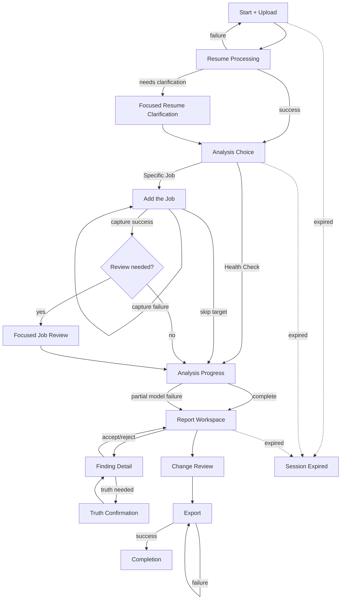

# Structural Wireframes

**Product:** Resume Analyze Tool  
**Market:** New Zealand  
**Status:** Working structural wireframes  
**Date:** 2026-09-28

## Wireframe principles

These wireframes define hierarchy, content, controls, states, and responsive behavior. They deliberately avoid visual styling decisions.

Core rules:
- Candidate use is anonymous by default.
- Resume Health Check and Full Application Analysis share the same product shell.
- One candidate flow, optional Job Target branch.
- Progressive disclosure instead of information dumping.
- No fake progress percentages.
- No silent Resume mutation.
- No mandatory signup.
- No page whose only job is decoration.
- Evidence provenance is available but not allowed to overwhelm the primary action.
- Mobile is a first-class layout, not a shrunken desktop.

---

# Global candidate shell

## Container

Desktop:
```text
┌──────────────────────────────────────────────────────────────┐
│ Logo / Product name                         Privacy / Help    │
├──────────────────────────────────────────────────────────────┤
│                                                              │
│                    Page content                              │
│                                                              │
└──────────────────────────────────────────────────────────────┘
```

Mobile:
```text
┌──────────────────────────┐
│ Logo               Help  │
├──────────────────────────┤
│                          │
│ Page content             │
│                          │
└──────────────────────────┘
```

## Annotation

- No permanent candidate navigation is required before a report exists.
- Do not expose admin navigation to anonymous candidate sessions.
- A small privacy affordance should remain easy to find during upload/analysis.
- When an active anonymous session exists, restore the candidate to the latest safe state.

---

# C1. Start + Resume Upload

## Screen job

Get the candidate from arrival to a valid Resume with the least friction possible.

## Primary action

**Upload CV / Resume**

## Container

Desktop:
```text
┌──────────────────────────────────────────────────────────────┐
│ Logo                                              Help       │
├──────────────────────────────────────────────────────────────┤
│                                                              │
│  Make your CV easier for hiring systems and recruiters       │
│  to understand.                                              │
│                                                              │
│  Evidence-backed feedback for LinkedIn, SEEK and             │
│  downstream application systems.                             │
│                                                              │
│  ┌────────────────────────────────────────────────────────┐  │
│  │ Drop PDF or DOCX here                                 │  │
│  │                                                       │  │
│  │              [ Choose file ]                          │  │
│  │                                                       │  │
│  │ PDF or DOCX                                           │  │
│  └────────────────────────────────────────────────────────┘  │
│                                                              │
│  ✓ No account required                                      │
│  ✓ Your original file is temporary                          │
│  ✓ We do not invent experience or qualifications            │
│                                                              │
│  [How your data is handled]                                  │
│                                                              │
└──────────────────────────────────────────────────────────────┘
```

Mobile:
```text
┌──────────────────────────┐
│ Logo               Help  │
├──────────────────────────┤
│ Improve your CV for      │
│ automated screening and  │
│ recruiters               │
│                          │
│ Evidence-backed feedback │
│ for LinkedIn and SEEK    │
│                          │
│ ┌──────────────────────┐ │
│ │ Upload PDF or DOCX   │ │
│ │                      │ │
│ │ [ Choose file ]      │ │
│ └──────────────────────┘ │
│                          │
│ No account required      │
│ Original file temporary  │
│                          │
│ Data handling details    │
└──────────────────────────┘
```

## Content

Primary label:
- "Upload CV / Resume"

Supporting copy:
- PDF and DOCX fully supported for MVP.
- Legacy format guidance may appear after unsupported upload rather than cluttering the default screen.

## States

### Uploading
Show:
- filename;
- file size;
- upload progress;
- cancel action.

### Validating
Show:
- "Checking your file…"
- no fake percentage.

### Unsupported format
Show:
- detected format;
- what the analyzer supports;
- conversion/retry action;
- platform compatibility guidance if relevant.

### Encrypted / corrupt / unsafe
Show:
- plain-language reason;
- retry with another file.

### Scanned/image-only
Show:
- "This looks like a scanned document. We’re trying to read it."
- if OCR fallback fails, offer another file.

## Annotation

- Drag-and-drop is additive, never the only interaction.
- File input must work by keyboard.
- The upload control must have an accessible name and clear accepted formats.
- Do not ask for platform choice here.

---

# C2. Resume Processing

## Screen job

Reassure the candidate that extraction is happening and interrupt only when necessary.

## Container

```text
┌──────────────────────────────────────────────────────────────┐
│ Reading your CV                                              │
│                                                              │
│ ✓ File received                                              │
│ ● Reading sections and work history                          │
│ ○ Checking structure                                         │
│                                                              │
│ This usually completes automatically.                        │
│                                                              │
│ [Cancel analysis]                                            │
└──────────────────────────────────────────────────────────────┘
```

## Normal success

Auto-advance to C3.

## Conditional extraction review

Only if a high-impact field is uncertain:

```text
┌──────────────────────────────────────────────────────────────┐
│ We need one quick check                                      │
│                                                              │
│ We could not reliably read this date:                        │
│                                                              │
│ Senior Designer                                              │
│ Acme Ltd                                                     │
│ "2022 – ?"                                                   │
│                                                              │
│ End date                                                     │
│ [ Month ] [ Year ]   [ Still working here ]                  │
│                                                              │
│ [ Confirm ]                                                  │
└──────────────────────────────────────────────────────────────┘
```

## Annotation

- Do not show the candidate a full extracted Resume form.
- Raw source deletion occurs after successful normalization; candidate-facing copy can confirm this later rather than interrupting flow.

---

# C3. Analysis Choice

## Screen job

Decide whether to branch into Job Target capture.

## Container

Desktop:
```text
┌──────────────────────────────────────────────────────────────┐
│ Your CV is ready                                             │
│                                                              │
│ Are you applying for a specific job?                         │
│                                                              │
│ ┌────────────────────────┐  ┌──────────────────────────────┐ │
│ │ Yes                    │  │ Not yet                      │ │
│ │                        │  │                              │ │
│ │ Analyze my CV against  │  │ Check my CV on its own      │ │
│ │ a specific role        │  │                              │ │
│ │                        │  │ Document compatibility,      │ │
│ │ Best for qualification │  │ parseability and general    │ │
│ │ matching               │  │ improvements                │ │
│ │                        │  │                              │ │
│ │ [ Add the job ]        │  │ [ Check my CV ]             │ │
│ └────────────────────────┘  └──────────────────────────────┘ │
└──────────────────────────────────────────────────────────────┘
```

Mobile:
- Stack the two cards vertically.
- Full Application Analysis appears first because it is the flagship path.
- Do not visually shame the candidate for choosing Resume Health Check.

## Transition

- "Add the job" → C4
- "Check my CV" → C6

---

# C4. Add the Job

## Screen job

Capture the Job Target with minimal manual work.

## Primary hierarchy

1. Screenshot / image
2. Saved job-ad file
3. URL where supported
4. Paste as fallback

## Container

Desktop:
```text
┌──────────────────────────────────────────────────────────────┐
│ Add the job                                                  │
│ Give us the job ad so we can compare your CV to the role.    │
│                                                              │
│ Recommended                                                  │
│ ┌──────────────────────────┐ ┌─────────────────────────────┐ │
│ │ Upload screenshot(s)     │ │ Upload saved job ad        │ │
│ │ PNG / JPG / image        │ │ PDF / document             │ │
│ │ [ Choose images ]        │ │ [ Choose file ]            │ │
│ └──────────────────────────┘ └─────────────────────────────┘ │
│                                                              │
│ Or                                                           │
│ [ Job URL ______________________________________________ ]   │
│ [ Import ]                                                   │
│                                                              │
│ [ Paste job text instead ]                                   │
│                                                              │
│ [ Continue with CV Health Check ]                            │
└──────────────────────────────────────────────────────────────┘
```

Mobile:
- One capture option per row/card.
- Camera/photo selection can be offered through the device file picker.
- "Continue with CV Health Check" remains visible but secondary.

## URL unsupported state

```text
We can't automatically import this page.

For this source, upload a screenshot or saved job-ad file instead.

[ Upload screenshot ] [ Upload file ]
[ Paste text ]
```

## Annotation

- Do not tell the user "scraping is prohibited" in normal flow unless useful. Explain the actionable limitation.
- URL ingestion must fail closed.
- Multiple screenshots should be reorderable if order matters.

---

# C5. Job Target Review

## Screen job

Resolve only high-impact ambiguity before analysis.

## Container

```text
┌──────────────────────────────────────────────────────────────┐
│ Quick check: we found 2 things to confirm                    │
│                                                              │
│ Job                                                          │
│ Senior Project Manager · Example Ltd                         │
│                                                              │
│ 1 of 2                                                       │
│ Is 5 years of project management experience:                 │
│                                                              │
│ ( ) Required                                                 │
│ ( ) Preferred                                                │
│ ( ) Not stated / unsure                                      │
│                                                              │
│ Source excerpt                                               │
│ "...five years' experience preferred..."                     │
│                                                              │
│ [ Back ]                                      [ Confirm ]     │
└──────────────────────────────────────────────────────────────┘
```

## Annotation

- Present one focused ambiguity at a time on mobile.
- Desktop may show a compact list if there are only a few.
- If there are many uncertain high-impact fields, signal that the capture may be incomplete and recommend a better source rather than forcing a large correction exercise.

---

# C6. Analysis Progress

## Screen job

Make long-running work feel trustworthy and interruptible.

## Container

```text
┌──────────────────────────────────────────────────────────────┐
│ Analyzing your application                                   │
│                                                              │
│ ✓ Read CV                                                    │
│ ✓ Checked document compatibility                             │
│ ● Comparing your experience to the role                      │
│ ○ Validating recommendations                                 │
│ ○ Preparing your report                                      │
│                                                              │
│ You can leave this tab open.                                 │
│                                                              │
│ [Cancel]                                                     │
└──────────────────────────────────────────────────────────────┘
```

Health Check variant omits role-comparison step.

## Slow-state annotation

After a meaningful delay:
- keep stage label;
- add "This is taking longer than usual, but your completed steps are saved in this session."
- never invent an ETA.

## Partial failure transition

If model-assisted work fails:
- move to C7 with partial-report banner.

---

# C7. Report Workspace

## Screen job

Tell the candidate what matters first, then let them inspect evidence and act.

## Desktop container

```text
┌────────────────────────────────────────────────────────────────────┐
│ Report: Senior Project Manager · Example Ltd        [Export later] │
├───────────────────┬────────────────────────────────────────────────┤
│ SUMMARY RAIL      │ MAIN CONTENT                                   │
│                   │                                                │
│ Document          │ Top actions                                    │
│ Compatibility     │ ┌────────────────────────────────────────────┐ │
│ Strong            │ │ 1. Clarify leadership scope               │ │
│                   │ │ High impact                               │ │
│ Parseability      │ │ [Review change]                           │ │
│ Strong            │ └────────────────────────────────────────────┘ │
│                   │ ┌────────────────────────────────────────────┐ │
│ Qualification     │ │ 2. Add evidence for budget ownership      │ │
│ Coverage          │ │ High impact                               │ │
│ Needs work        │ │ [View finding]                            │ │
│                   │ └────────────────────────────────────────────┘ │
│ Screening         │                                                │
│ Alignment         │ Findings                                       │
│ Good              │ [Critical 1] [High impact 4] [Improve 6]      │
│                   │                                                │
│                   │ ┌ Finding card ─────────────────────────────┐ │
│                   │ │ Missing qualification evidence            │ │
│                   │ │ "Stakeholder management"                 │ │
│                   │ │ General ATS guidance · Medium confidence │ │
│                   │ │ [Why this matters] [Review change]       │ │
│                   │ └────────────────────────────────────────────┘ │
├───────────────────┴────────────────────────────────────────────────┤
│ Changes: 2 accepted · 1 needs confirmation        [Review changes] │
└────────────────────────────────────────────────────────────────────┘
```

## Mobile container

```text
┌──────────────────────────┐
│ Report                   │
│ Senior Project Manager   │
├──────────────────────────┤
│ Top actions              │
│ [Action card]            │
│ [Action card]            │
├──────────────────────────┤
│ Your analysis            │
│ Compatibility   Strong   │
│ Parseability    Strong   │
│ Qualifications  Needs... │
│ Screening       Good     │
├──────────────────────────┤
│ Findings                 │
│ [Filter]                 │
│ [Finding card]           │
│ [Finding card]           │
├──────────────────────────┤
│ [Review 2 changes]       │  ← sticky bottom action when relevant
└──────────────────────────┘
```

## Report hierarchy

1. Top Actions
2. Dimension summaries
3. Findings list
4. Change Set access
5. Detailed provenance on demand

## Partial-report banner

```text
Some AI-assisted checks are temporarily unavailable.

Your document compatibility and parseability results are complete.

[Retry missing checks]
```

Do not show unavailable dimensions as zero.

## Annotation

- Desktop summary rail becomes stacked cards on mobile.
- Do not split each dimension into its own route unless later usability evidence demands it.
- Finding filters may use severity and status, but should not require complex taxonomy.

---

# C8. Finding Detail + Proposed Change

## Screen job

Explain one finding deeply enough for the candidate to make a decision.

## Desktop behavior

Use a right-side drawer or focused detail pane so the user keeps report context.

```text
┌──────────────────────────────────────────────┐
│ High impact                              [×] │
│                                              │
│ Your leadership scope is unclear             │
│                                              │
│ Why this matters                             │
│ The target role asks for team leadership.    │
│ Your CV says "supported delivery" but does   │
│ not state whether you led the team.          │
│                                              │
│ Evidence                                     │
│ Resume: "Supported project delivery..."      │
│ Job: "Lead cross-functional teams..."        │
│                                              │
│ Guidance                                     │
│ AI interpretation · Medium confidence        │
│ [View evidence details]                      │
│                                              │
│ Proposed change                              │
│ Before: Supported project delivery...        │
│ After:  Led project delivery...              │
│                                              │
│ ⚠ We need your confirmation before using     │
│ "Led".                                       │
│                                              │
│ [Confirm experience]                         │
└──────────────────────────────────────────────┘
```

## Safe rewrite variant

If fully supported:
```text
[Accept change] [Reject]
```

## No-safe-change variant

```text
We found a gap, but we cannot safely rewrite this without new factual information.

[Dismiss] [Tell us more]
```

## Mobile behavior

- Full-height bottom sheet or dedicated detail view.
- Preserve a clear back path to the same report scroll/filter state.

---

# C9. Candidate Truth Confirmation

## Screen job

Collect one factual answer that unlocks or blocks a meaningful Proposed Change.

## Container

```text
┌──────────────────────────────────────────────┐
│ Confirm your experience                      │
│                                              │
│ The job asks for Kubernetes experience, but  │
│ your CV does not mention it.                 │
│                                              │
│ Do you have real Kubernetes experience?      │
│                                              │
│ [ Yes ]  [ No ]                              │
│                                              │
│ If yes:                                      │
│ [ Briefly describe where/how you used it ]   │
│                                              │
│ This information may be used to propose a    │
│ truthful CV change.                          │
│                                              │
│ [Cancel]                         [Continue]   │
└──────────────────────────────────────────────┘
```

## Annotation

- This is not a quiz.
- Do not preselect "Yes."
- Do not ask for unnecessary personal detail.
- A "No" answer is valid and must not produce manipulative copy.

---

# C10. Change Review

## Screen job

Let the candidate see exactly what they approved before export.

## Desktop container

```text
┌──────────────────────────────────────────────────────────────┐
│ Review your changes                                          │
│                                                              │
│ Accepted 4    Rejected 2    Needs confirmation 1             │
│                                                              │
│ Experience                                                   │
│ ┌──────────────────────────────────────────────────────────┐ │
│ │ BEFORE                                                   │ │
│ │ Supported delivery of enterprise projects               │ │
│ │                                                         │ │
│ │ AFTER                                                    │ │
│ │ Led delivery of enterprise projects                     │ │
│ │                                                         │ │
│ │ Why: strengthens supported leadership evidence          │ │
│ │ [Undo acceptance]                                       │ │
│ └──────────────────────────────────────────────────────────┘ │
│                                                              │
│ [Back to findings]                           [Continue]       │
└──────────────────────────────────────────────────────────────┘
```

## Mobile

- One change card at a time or vertically stacked cards.
- Sticky "Continue" only when unresolved confirmation does not block export.

## Annotation

- If unresolved truth confirmations affect accepted content, block export with a clear reason.
- Rejected changes remain visually secondary.

---

# C11. Export

## Screen job

Generate the candidate-controlled final document.

## Container

```text
┌──────────────────────────────────────────────────────────────┐
│ Export your improved CV                                      │
│                                                              │
│ 4 accepted changes will be included.                         │
│ No additional AI rewriting happens during export.            │
│                                                              │
│ Choose format                                                │
│ ( ) PDF                                                      │
│ ( ) DOCX                                                     │
│                                                              │
│ [ Generate file ]                                            │
└──────────────────────────────────────────────────────────────┘
```

## Generating state

```text
Preparing your DOCX…
Your analysis and accepted changes are already saved in this session.
```

## Export failure

```text
We couldn't generate the file.

Your report and accepted changes are still here.

[Try again] [Choose another format]
```

## Success

```text
Your CV is ready.

[Download DOCX]

Your original upload has already been deleted.
This anonymous session will expire automatically.

[Analyze another job]   [Start over]
```

## Annotation

- "Analyze another job" is offered only if reusing the normalized Resume within the active session is allowed by final retention policy.
- Never force account creation here.

---

# C12. Session Expired

## Screen job

Explain lost state honestly and provide a clean restart.

## Container

```text
┌──────────────────────────────────────────────────────────────┐
│ This private session has expired                             │
│                                                              │
│ Your CV and analysis were not kept permanently.              │
│ To run another analysis, upload your CV again.               │
│                                                              │
│ [ Start new analysis ]                                       │
└──────────────────────────────────────────────────────────────┘
```

## Annotation

Do not imply recovery is possible after data deletion.

---

# C13. Generic Candidate Error Surface

## Screen job

Recover from unexpected failure without dumping technical diagnostics.

## Pattern

```text
We couldn't complete this step.

What happened:
Plain-language category.

What is safe:
Your completed work is still available / No file was stored / etc.

What you can do:
[Retry] [Use another method] [Return to report]
```

## Annotation

- Error copy must be specific to the failed stage.
- Do not expose provider stack traces or internal IDs unless offered under a support-details affordance.

---

# Candidate transition map



---

# Responsive behavior

## Desktop

- Candidate flow max-width should remain readable rather than stretching edge to edge.
- Report Workspace may use a two-column layout:
  - fixed or sticky analysis summary rail;
  - flexible findings/content area.
- Finding Detail may use a side drawer to preserve context.
- Change Review may show before/after columns when enough width exists.

## Tablet

- Collapse report summary rail into a horizontal/stacked dimension summary.
- Finding Detail can become a large modal/drawer.
- Avoid three-column layouts.

## Mobile

- One primary column.
- Sticky bottom action is appropriate for:
  - "Add the job";
  - "Review changes";
  - "Continue";
  - "Generate file";
  only when it does not cover required content.
- Finding Detail becomes full-height sheet/page.
- Before/after content stacks vertically.
- Job screenshots should use native image/file selection.
- Progress text cannot depend on animation.
- Avoid horizontal tables for candidate-facing content.

---

# Accessibility annotations

These are structural requirements, not later polish:

- Upload and capture controls must work by keyboard.
- Drag-and-drop must have a standard file-input equivalent.
- Analysis state changes must be announced through an appropriate live region without repeatedly interrupting screen-reader users.
- Severity must not be encoded by colour alone.
- "Strong", "Needs work", and similar status labels require text equivalents.
- Drawer/sheet focus must be trapped correctly and returned to the invoking control on close.
- Before/after comparisons must be understandable linearly by assistive technology.
- Accepted/rejected states must expose programmatic state.
- Disabled export must explain what unresolved requirement blocks it.
- Motion is optional decoration; all critical state must be available without motion.
- Touch targets on mobile must be comfortably operable.
- Error messages must be associated with the relevant control or stage.

---

# Operator Wireframes

The operator surface is intentionally separate from the candidate experience.

## O1. Admin Sign In

```text
┌──────────────────────────────────────────────┐
│ Admin                                        │
│                                              │
│ Email / identity provider                   │
│ [ Sign in ]                                  │
└──────────────────────────────────────────────┘
```

Authentication mechanism remains implementation-dependent.

---

## O2. Operator Dashboard

## Screen job

Show operational health without exposing candidate Resume content.

```text
┌──────────────────────────────────────────────────────────────┐
│ Organization: Client Name                 [Admin menu]        │
├──────────────────────────────────────────────────────────────┤
│ Usage today                                                  │
│ Analyses: 124     Partial failures: 3     Export failures: 1 │
│                                                              │
│ Service health                                               │
│ Resume extraction    Healthy                                 │
│ Model provider       Healthy                                 │
│ Evidence monitoring  2 changes need review                   │
│                                                              │
│ [Review evidence updates]                                    │
│ [Configuration]                                              │
└──────────────────────────────────────────────────────────────┘
```

## Annotation

- No raw Resume preview.
- No candidate search by default.
- Operational metrics should remain aggregate unless a future support workflow explicitly justifies more detail.

---

## O3. Evidence Review Queue

```text
┌──────────────────────────────────────────────────────────────┐
│ Evidence updates                                             │
│                                                              │
│ LinkedIn · Resume upload guidance                            │
│ Source changed today                                         │
│ Materiality: High                                            │
│ [Review]                                                     │
│                                                              │
│ SEEK · Questionnaire documentation                           │
│ Source changed 2 days ago                                    │
│ Materiality: Medium                                          │
│ [Review]                                                     │
└──────────────────────────────────────────────────────────────┘
```

Filters:
- platform;
- materiality;
- review status.

---

## O4. Evidence Change Review

```text
┌──────────────────────────────────────────────────────────────┐
│ LinkedIn · Resume upload guidance                            │
│                                                              │
│ Official source                                              │
│ [Open source]                                                │
│                                                              │
│ Source diff                                                  │
│ BEFORE: ...                                                  │
│ AFTER:  ...                                                  │
│                                                              │
│ Proposed registry change                                    │
│ Rule: PDF/DOCX supported ...                                 │
│ Evidence class: Platform rule                                │
│ Applicability: ...                                           │
│                                                              │
│ Impacted analyzer rule(s)                                    │
│ • Document Compatibility                                    │
│                                                              │
│ [Reject proposal]                  [Publish new version]      │
└──────────────────────────────────────────────────────────────┘
```

## Annotation

- Publishing is a deliberate action.
- Rejecting does not delete the last published evidence.
- Show the source and the proposed interpretation separately.
- High-impact changes should require clear confirmation before publication.

---

## O5. Organization Configuration

```text
┌──────────────────────────────────────────────────────────────┐
│ Organization settings                                        │
│                                                              │
│ Branding                                                     │
│ Product name [________]                                      │
│ Logo         [Upload]                                        │
│                                                              │
│ Usage controls                                               │
│ Daily analysis ceiling [____]                                │
│ Upload limit          [____]                                 │
│                                                              │
│ Feature availability                                         │
│ [x] Resume Health Check                                      │
│ [x] Full Application Analysis                                │
│ [x] PDF export                                               │
│ [x] DOCX export                                              │
│                                                              │
│ [Save changes]                                               │
└──────────────────────────────────────────────────────────────┘
```

## Annotation

Only include controls that genuinely need operator configurability. Avoid turning every implementation constant into a settings field.

---

# Critical states inventory

The implementation must account for these states explicitly:

Candidate:
- fresh session;
- resumed active session;
- expired session;
- upload idle;
- uploading;
- validation;
- unsupported format;
- encrypted/corrupt file;
- scanned/OCR fallback;
- extraction uncertainty;
- Resume normalized;
- Health Check selected;
- Full Application selected;
- Job Capture idle;
- capture uploading;
- URL retrieval unsupported;
- capture failed;
- Job Target low confidence;
- analysis queued;
- analyzing;
- long-running;
- partial model failure;
- full report;
- partial report;
- no Critical findings;
- no Proposed Changes;
- Candidate confirmation required;
- accepted change;
- rejected change;
- unresolved confirmation;
- export blocked;
- exporting;
- export failed;
- export ready;
- cancellation;
- rate limited;
- anonymous-session expiry warning;
- expired session.

Operator:
- signed out;
- signed in;
- no evidence changes;
- evidence proposal pending;
- evidence source fetch failed;
- publish confirmation;
- proposal rejected;
- registry published;
- service degraded;
- usage limit reached;
- configuration saved;
- configuration validation error.

---

# Wireframe decisions

1. Combine landing and Resume upload into one actionable start screen.
2. Keep Resume processing mostly automatic; use focused clarification only when analysis reliability depends on it.
3. Ask about a specific Job Target only after Resume normalization.
4. Present Job Capture as multimodal cards, with screenshot/image first.
5. Treat URL import as one adapter, not the dominant UI.
6. Use focused uncertainty review instead of a full Job Target editing form.
7. Use one Report Workspace rather than separate routes for every analysis dimension.
8. Keep Top Actions above dimension summaries and detailed findings.
9. Use a contextual detail pane/sheet for Findings and Proposed Changes.
10. Use Candidate Truth Confirmation as a focused interruption, never as a pre-analysis questionnaire.
11. Keep a visible Change Set and explicit Accept/Reject controls.
12. Require a before/after Change Review before export.
13. Separate export generation from analysis and prohibit new generative edits during export.
14. Keep candidate and operator navigation completely separate.
15. Give Evidence Review its own operator workflow because publication changes production behavior.
16. Treat responsive behavior and accessibility states as implementation requirements, not post-MVP polish.

---

# Pending questions / assumptions

The wireframe is structurally stable, but the following are deliberately left for later design/quality decisions:

- final visual style and design system;
- whether inline editing of Proposed Changes ships in MVP;
- whether Top Actions defaults to 3, 4, or another number;
- exact copy for score/status labels;
- exact session-expiry warning timing;
- final export formats for the first client contract;
- whether active-session Resume reuse across multiple Job Targets is enabled at launch;
- final mobile treatment for multi-image Job Capture ordering;
- whether report filters use tabs, chips, or another control;
- exact operator authentication method;
- final rate-limit UX;
- exact accessibility acceptance criteria and screen-reader announcement behavior;
- visual treatment for evidence provenance and confidence.
